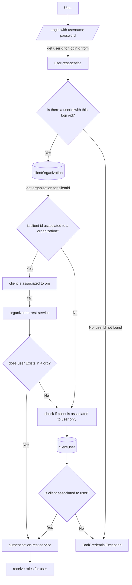

# My Customization of Spring Authorization Server
This is a customization of the Spring Authorization Server which implements OAuth2.1 and OpenID Connect 1.0 specifications.


## Purpose
This authorization service will be used for issuing access-token/refresh tokens for services. 

This application also exposes a rest client for OAuth Client registration at endpoint `clients/`.

This app will communicate with the following two external services:
`authentication-rest-service` for authenticating user with username and password.
`application-rest-service` for getting user roles.

## Run
For running locally using local profile:
```bash
./gradlew bootRun --args="--spring.profiles.active=local"
```

In IntelliJ open Run and add environment variable :'`spring.profiles.active=local` 

## Local Development

Add local tenant hostnames to `/etc/hosts`:

```text
127.0.0.1 platform.openissuer.test
127.0.0.1 business1.openissuer.test business2.openissuer.test free.openissuer.test
```

Local issuer URLs:
- `http://platform.openissuer.test:9001`
- `http://business1.openissuer.test:9001`
- `http://business2.openissuer.test:9001`
- `http://free.openissuer.test:9001`

Run authorization with the local profile:

```bash
./gradlew bootRun --args="--spring.profiles.active=local"
```

### Local HTTPS for Passkeys/WebAuthn

Passkeys require a trusted secure browser context. For local passkey testing, use the `local-https` profile with `mkcert`.

Install and trust the local mkcert CA once:

```bash
brew install mkcert nss
mkcert -install
```

Create the local certificate used by `src/main/resources/application-local-https.yaml`:

```bash
mkdir -p ~/openissuer-local-certs
mkcert \
  -cert-file ~/openissuer-local-certs/openissuer.test.pem \
  -key-file ~/openissuer-local-certs/openissuer.test-key.pem \
  free.openissuer.test \
  platform.openissuer.test \
  business1.openissuer.test \
  business2.openissuer.test \
  localhost \
  127.0.0.1
```

Run authorization with local HTTPS enabled:

```bash
unset ISSUER_ADDRESS
unset ISSUER_URI
SPRING_PROFILES_ACTIVE=local,local-https ./gradlew bootRun
```

Use the HTTPS tenant URL for passkey registration:

```text
https://free.openissuer.test:9001/mfa/passkeys
```

Expected startup/runtime clues:
- `creating non-loadBalanced token webclient`
- `set stable token request host headers host=platform.openissuer.test scheme=https port=9001`

The `local-https` profile uses a non-load-balanced token WebClient only for this local HTTPS mode. Without that, Eureka may resolve `authorization-server` to an HTTP instance such as `http://10.0.0.244:9001`, which fails because the local server is listening with TLS on port `9001`.

If Chrome shows "This Connection is Not Private", run `mkcert -install`, then fully quit and reopen Chrome. Safari may show an Apple passkey/iCloud dialog; Chrome has also been verified locally with Touch ID.

## Build Docker image
Gradle build:
```
./gradlew bootBuildImage --imageName=name/my-spring-authorization-server
```
Docker build passing in username and personal access token varaibles into docker to be used as environment variables in the gradle `build.gradle` file for pulling private maven artifact:
```
docker build --secret id=USERNAME,env=USERNAME --secret id=PERSONAL_ACCESS_TOKEN,env=PERSONAL_ACCESS_TOKEN . -t my/auth-servier
```

Pass local profile as argument:
```
 docker run -e --spring.profiles.active=local -p 9001:9001 -t myorg/myapp
```


## Authentication process

