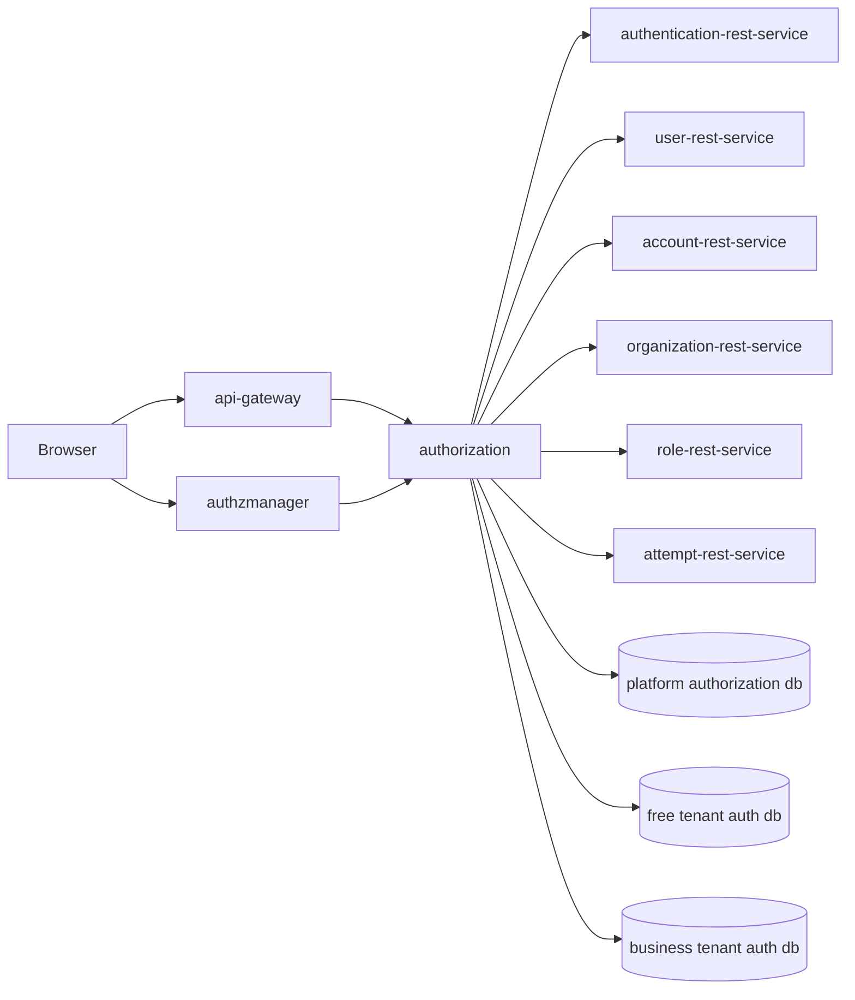
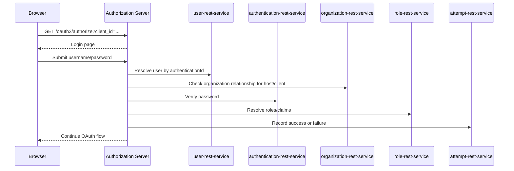

# Architecture

OpenIssuer Authorization Server is one service in a set of identity and administration services. The browser enters through either the authorization issuer host or AuthzManager. The authorization server then coordinates backend services through service discovery or Kubernetes service DNS.

## Components

| Component | Responsibility |
| --- | --- |
| `authorization` | OAuth/OIDC issuer, login UI, signup UI, client registration APIs, passkey MFA. |
| `authzmanager` | Admin UI for organizations, users, clients, roles, profile, and passkey enrollment navigation. |
| `api-gateway` | Public gateway and host/path routing in front of services. |
| `authentication-rest-service` | Username/password credential verification and password persistence. |
| `user-rest-service` | User profile and authentication ID lookup. |
| `account-rest-service` | Account activation, reset, lock/unlock, and email trigger flows. |
| `organization-rest-service` | Organization, subdomain, user-organization membership, and default organization state. |
| `role-rest-service` | Application role checks and scoped AuthzManager role assignments. |
| `attempt-rest-service` | Login attempt tracking and lockout support. |

## High-Level Flow



## Login Flow



## Token And JWK Storage

Spring Authorization Server components are selected by issuer host:

- `RegisteredClientRepository`
- `OAuth2AuthorizationService`
- `OAuth2AuthorizationConsentService`
- `JWKSource`

Default hosts use the platform authorization database. Tenant hosts use tenant-specific authorization databases. This prevents clients, authorizations, consent records, and keys for one issuer from being mixed with another issuer.

## Service-To-Service Tokens

Outbound service calls can use the token filter to request or forward OAuth tokens. In Kubernetes, token requests use stable issuer headers so the authorization server creates service-to-service tokens with the expected issuer. This matters because resource services validate issuer and JWK URLs.

## Scoped AuthzManager Roles

AuthzManager administration uses two scoped roles:

| Role | Scope | Current authorization-server use |
| --- | --- | --- |
| `OrgAdmin` | Organization ID | Required to sign in to the AuthzManager admin host associated with that organization and to manage its OAuth clients. |
| `SubdomainAdmin` | Subdomain ID | Assigned to configured bootstrap users for future subdomain-level administration. It does not currently satisfy the AuthzManager login check by itself. |

`role-rest-service` stores both through `Authz_Manager_Role_Assignment`. The `scope_type` identifies an `ORGANIZATION` or `SUBDOMAIN` assignment, and `scope_id` contains the corresponding organization or subdomain UUID.

The authorization server resolves the organization associated with the current admin host and calls the explicit organization check:

```http
GET /roles/authzmanagerroles/users/{userId}/organizations/{organizationId}/org-admin
```

Configured seed users marked as subdomain administrators currently receive an `OrgAdmin` assignment for the host organization as well as a `SubdomainAdmin` assignment for the subdomain. Making `SubdomainAdmin` imply organization administration without that additional row remains future work and requires a reliable subdomain-to-organization lookup during authorization.

Existing subdomain administrators can manage assignments from AuthzManager's subdomain user view. The target user must have a default organization in the same subdomain and must already be `OrgAdmin` for that organization. Management calls are scoped to the acting administrator's subdomain, duplicate assignments are rejected, and the final `SubdomainAdmin` assignment cannot be removed.
