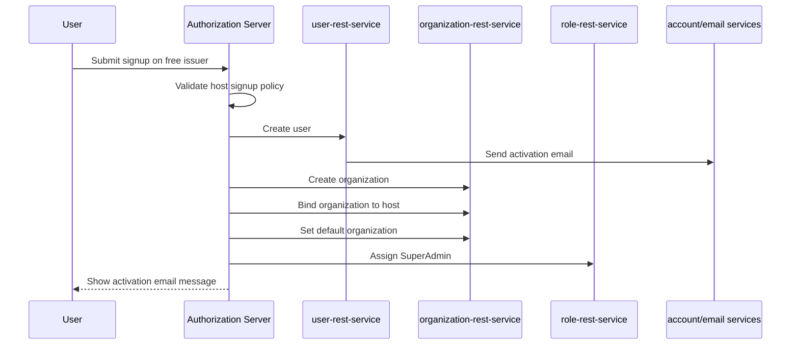

# Signup And Tenant Onboarding

OpenIssuer has two related but separate concepts:

- User signup: create a user account and attach it to an organization.
- Tenant onboarding: create or register a new issuer host and tenant authorization database.

The current authorization server implements the core flows needed for both. Full business self-service onboarding still needs infrastructure automation around DNS, gateway routes, database provisioning, and secrets.

## Signup Policies

Signup behavior is configured per host:

```yaml
authorization-server:
  signup-policy:
    hosts:
      free.openissuer.com:
        allow-signup: true
        create-organization-on-signup: true
        allowed-email-domains:
          - "*"
      business1.openissuer.com:
        allow-signup: true
        create-organization-on-signup: false
        allowed-email-domains:
          - business1.com
```

Policy fields:

| Field | Meaning |
| --- | --- |
| `allow-signup` | Enables or disables signup on that host. |
| `create-organization-on-signup` | Creates a new organization for the user when true; attaches to the existing host organization when false. |
| `allowed-email-domains` | Restricts signup email domains. `*` allows any domain unless the domain is reserved by another host. |

## Free/Public Signup

For the free issuer, signup is designed to create a new organization for the user.

Example:

1. User visits `https://free.openissuer.com/signup`.
2. User submits name, email, password, and organization.
3. `UserSignupController` validates signup policy for `free.openissuer.com`.
4. Authorization server sends signup to `user-rest-service`.
5. User account is created and activation email is sent through downstream account/email services.
6. Authorization server creates an organization through `organization-rest-service`.
7. The new organization is mapped to the current host.
8. The user is set as default organization member.
9. `role-rest-service` assigns `SuperAdmin` for that organization.



## Business Host Signup

For a business issuer such as `business1.openissuer.com`, signup can be configured to attach users to an existing organization instead of creating a new organization:

```yaml
create-organization-on-signup: false
```

Flow:

1. User visits the business issuer signup page.
2. Email domain is validated against `allowed-email-domains`.
3. User account is created.
4. The user is attached to the organization bound to that host.
5. The host organization becomes the user's default organization.

This is appropriate when the business issuer already exists and new users should join that business organization.

## Business Issuer/Tenant Creation

Creating a new business issuer requires more than creating a user. A tenant issuer needs infrastructure:

- DNS route, for example `newbusiness.openissuer.com`.
- Gateway/HTTPRoute/Ingress entry.
- Authorization database and database user.
- Secret reference for the tenant DB password.
- Optional seeded clients.

The authorization server exposes tenant registration through:

```http
POST /admin/tenants
```

Example payload:

```json
{
  "tenantName": "newbusiness",
  "hosts": ["newbusiness.openissuer.com"],
  "url": "jdbc:postgresql://newbusiness-auth-db-rw/newbusinessauth",
  "username": "newbusinessauth",
  "passwordSecretRef": "newbusiness-db-password",
  "driverClassName": "org.postgresql.Driver"
}
```

After registration, the server:

- Creates a datasource for the tenant.
- Initializes Spring Authorization Server and WebAuthn schemas.
- Registers tenant-specific authorization components.
- Persists the tenant registration.
- Seeds issuer clients for that issuer.

## Activation Links

Signup sets `activationHost` from the current request host. Downstream account/email flows should use that tenant host so links point back to the correct issuer or admin host instead of a generic platform host.

Example:

```text
https://free.openissuer.com/accounts/active/password-secret/{id}/{secret}
```

## Return Context

Signup and related pages preserve a safe return context with `LoginReturnContextService`. This lets a user navigate away from login to signup, forgot password, or activation flows and still return to the OAuth client flow afterward when possible.

