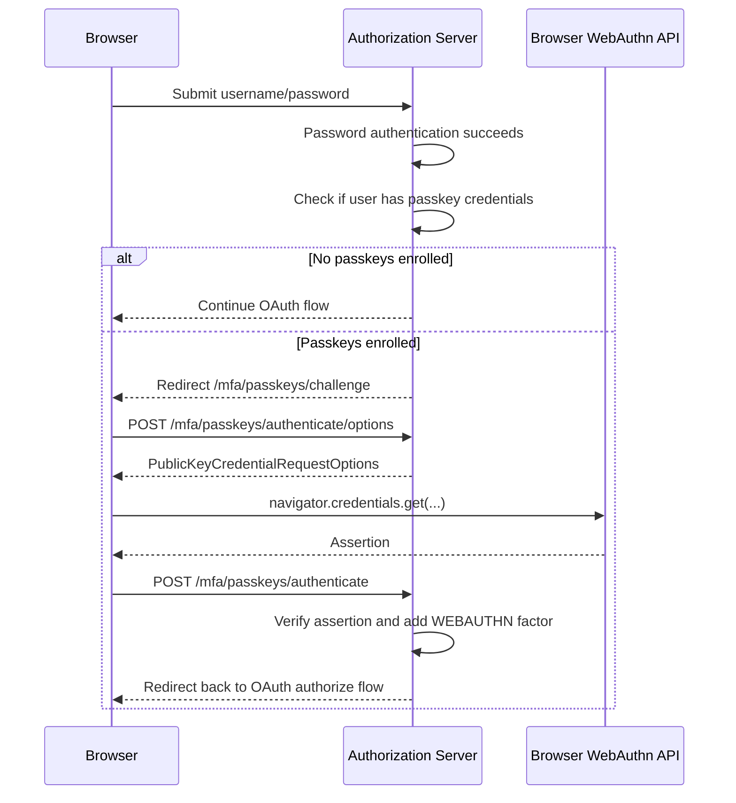

# Passkeys And MFA

Passkeys are WebAuthn credentials backed by a platform authenticator such as Touch ID, Windows Hello, Android, iCloud Keychain, or a hardware security key.

OpenIssuer supports passkeys both as a direct sign-in method and as a second factor after username/password login. If a user has enrolled at least one passkey, password login still requires passkey verification before the OAuth flow continues.

## Important Classes

- `PasskeyController`: passkey management page at `/mfa/passkeys`.
- `PasskeyMfaAuthenticationSuccessHandler`: intercepts successful password login and redirects to passkey challenge when required.
- `PasskeyMfaController`: creates WebAuthn assertion options and verifies passkey assertions.
- `PasskeyMfaService`: checks whether MFA is required and completes authentication after passkey success.
- `PasskeyLoginController`: starts and verifies discoverable-credential passkey login from the sign-in page.
- `PasskeyLoginService`: routes a verified passkey identity into the shared `AuthenticationCallout` authorization pipeline.
- `AuthenticationCallout`: applies the common account-lock, client, tenant, organization, role, and login-attempt behavior for password and passkey login.
- `TenantAwareWebAuthnRelyingPartyOperations`: tenant-aware WebAuthn relying party behavior.
- `TenantAwareUserCredentialRepository`: stores and reads credentials from the current tenant.
- `TenantAwarePublicKeyCredentialUserEntityRepository`: resolves passkey user entities per tenant.

## Enrollment Flow

Enrollment is initiated from AuthzManager. The profile page links to AuthzManager's passkey route, which redirects to the authorization server:

```text
https://free.openissuer.com/mfa/passkeys?return_url=https://free.admin.openissuer.com/admin/user/profile
```

Flow:

1. User signs in to AuthzManager.
2. User opens profile and chooses passkeys.
3. AuthzManager redirects the user to `/mfa/passkeys` on the tenant issuer host.
4. Authorization server displays registered passkeys and an add-passkey form.
5. Browser calls WebAuthn `navigator.credentials.create`.
6. Spring Security WebAuthn stores the credential in the tenant-specific WebAuthn tables.
7. User can return to AuthzManager through the safe `return_url`.

## Login MFA Flow



## Direct Passkey Login Flow

The main login page includes **Sign in with a passkey**. This flow uses a discoverable credential so the authenticator identifies the user without a username or password.

1. The browser requests assertion options from `/passkeys/login/options`.
2. The browser prompts for a passkey with `navigator.credentials.get`.
3. The authorization server verifies the assertion at `/passkeys/login`.
4. The server applies the same client, tenant, organization, role, and account-lock checks used by normal login.
5. The authenticated session continues to the saved OAuth authorization request.

Passkeys enrolled before this feature must be discoverable credentials to appear in the username-free browser prompt.

## When MFA Is Required

`PasskeyMfaService.requiresPasskeyMfa` requires passkey MFA only when:

- Password authentication succeeded.
- A WebAuthn user entity exists for the username.
- At least one credential exists for that WebAuthn user entity.

This means passkey MFA is opt-in by enrollment. A user without enrolled passkeys continues with normal password login.

## Tenant Isolation

Passkey credential storage is tenant-aware. A credential enrolled under `free.openissuer.com` is stored with the `free` issuer's authorization/WebAuthn database and is not shared with another issuer.

## Browser Requirements

Passkeys require a secure browser context:

- Production must use HTTPS.
- Local development should use trusted local HTTPS with `mkcert`.
- Some browsers may reject WebAuthn on pages with certificate warnings.

Use `https://free.openissuer.test:9001` locally, not plain HTTP, for passkey testing.

## Local Testing Notes

Chrome has been verified with Touch ID using a trusted `mkcert` certificate. Safari may open an Apple passkey/iCloud dialog. Phone-based QR flows depend on browser profile, device pairing, network reachability, and platform passkey sync behavior.
